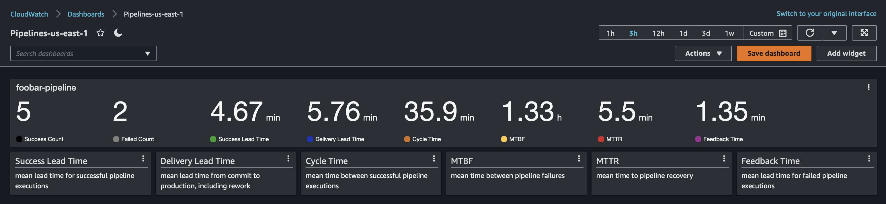
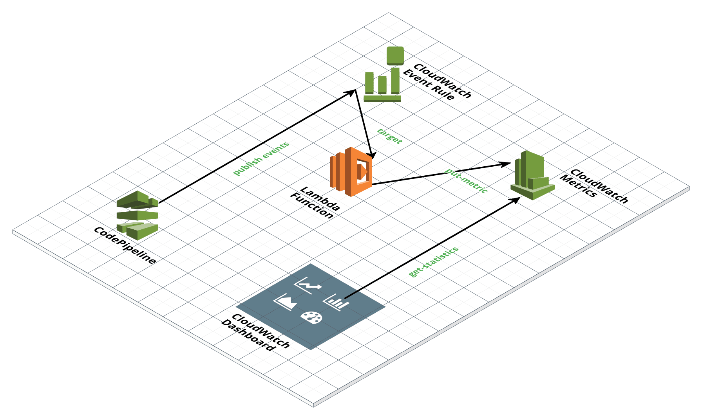
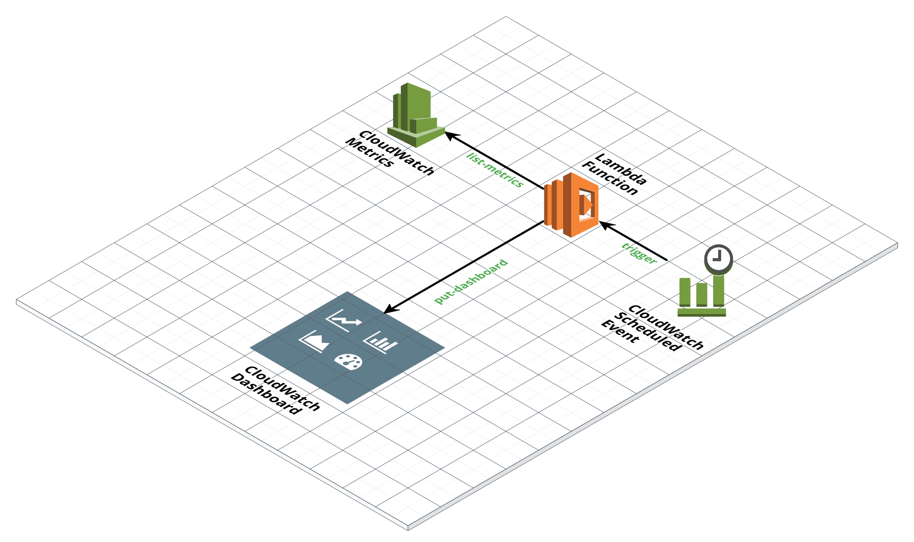
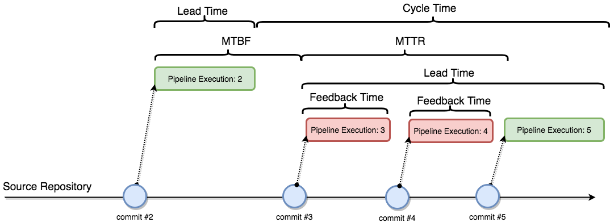

# Overview

Simple dashboard built for viewing pipeline metrics in AWS. Built using CloudWatch Dashboards and Metrics populated from CloudWatch Events that CodePipeline triggers.




## Deploy now!

1. You'll need to ensure that you have access to an S3 Bucket, if not, create one and note the name.
2. Create a new `.env` file and update the values to reflect your desired environment.
``` bash
cp .env-sample .env
```
Make sure you update the values to reflect your environment and situation:
* `STACK_NAME`: Replace with what you want your CloudFormation Stack name to be
* `BUCKET`: Replace with the name of the bucket you want to use for template and script storage
* `CFN_TEMPLATE`: This value can be left the same if you don't rename the default CloudFormation Template file
* `PIPELINE_PATTERN`: Replace this with the desired CodePipelne pattern name for your Dashboard
3. Run the `make` command to bundle the scripts and deploy the CloudFormation template.
``` bash
make deploy
```
4. Once the deploy commands are completed, you will need to trigger a few CodePipeline runs in order to update the CloudWatch dashboard. After these runs, go to the [CloudWatch Console](https://console.aws.amazon.com/cloudwatch) and click on **Dashboards** to see the metrics reflected in the dashboard. 


# Architecture

As seen in the diagram below, a Lambda function is triggered from a CloudWatch Event rule for CodePipeline events. The Lambda function then generates CloudWatch metrics. The CloudWatch dashboard is then build from the metrics that the Lambda function created.


The list of pipelines in the dashboard cannot be generated dyanmically so another Lambda function runs regulary to regenerate the dashboard based on whatever metrics have been created.



# Metric Details



| Metric | Description | How to Calculate | How to Interpret |
| -------| ----------- | ---------------- | ---------------- |
| `Cycle Time` | How often software is being delivered to production. | The mean interval of time between two consecutive successful pipeline executions. | If this number is less than `Lead Time` then many commits are being delivered to the pipeline before a previous commit is complete. If this number is significantly greater than `Lead Time` then the pipeline is delivering risky deployments due to the large batch size of the commits. |
| `Success Lead Time` | How quick does a pipeline run. | The mean amount of time from start to finish for successful pipeline runs. | This number gives you an idea of how much time to expect for a full successful run of the pipeline, from commit to production without any failures. |
| `Delivery Lead Time` | How long it takes for a change to go to production. | The mean amount of time from commit to production, including rework. | This is the number the business cares about most, as it represents how long it takes for a feature to get into the hands of the customer. If this number is too large, look at improving the availability of the pipeline `(MTBF / MTBF + MTTR)`. |
| `MTBF` | How often does the pipeline fail. | The mean interval of time between the start of a successful pipeline execution and the start of a failed pipeline execution.| This number should be high in comparison to `MTTR`. If this number is low, then consider improving the reliability of the pipeline by first researching if the root cause is the quality of new code being committed, or the repeatability of the infrastructure and test automation. |
| `MTTR` | How long does it take to fix the pipeline. | The mean interval of time between the start of a failed pipeline execution and the start of a successful pipeline execution.| This number should be low as it is a measure of a team's ability to "stop the line" when a build fails and swarm on resolving it. If the `Feedback Time` is high, then consider addressing that, otherwise the issue is with the team's responsiveness to failures. |
| `Feedback Time` | How quick can we identify failures. | The mean amount of time from commit to failure of a pipeline execution. | This number should be low as it affects `MTTR`. Ideally, failures would be detected as quick as possible in the pipeline, rather than finding them farther along in the pipeline. |


# Dependencies

The project has a couple of dependencies when deploying using the `make` command.

Please be sure to have the following items installed before using this project:
* [cfn_nag](https://github.com/stelligent/cfn_nag)
* [bump2version](https://pypi.org/project/bump2version/) (Only for development purposes)


# Development

To update the environment after adjusting the lamdba functions and python scripts you'll need to redeploy. First commit your changes and then determine if the changes/updates are worther of a patch, minor, or major version change. Then just run the corresponding deploy-VERSION command.
* Patch: `make deploy-patch`
* Minor: `make deploy-minor`
* Major: `make deploy-major`
